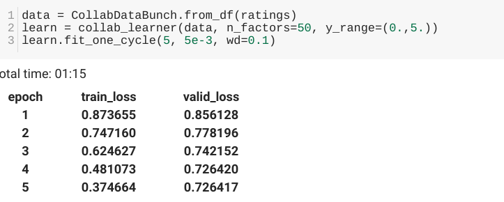

# Feb 25 2019 Update
## Christian Roncal, CMSC499A Leiserson

### What I've done
Over the weekend I experimented with writing collaborative filtering implementations. I had little experience with collaborative filtering so I was just running against the movielens dataset to build an understanding of using pytorch/ numpy for collaborative filtering.

I ended up doing the following:

**1. vanilla numpy with sgd:** I was successful in overfitting a small subset of movielens with vanilla sgd with bias. However, this was a pain to write and fancy tricks will also be expensive to write. Also would be slow for larger datasets.

**2. Pytorch matrix factorization adam/pytorch :** This seemed like the best transition to solve the problems mentioned above since it's kind of just like numpy with gpu support, and autograd. However, after implementing my own ``nn.module`` identical to the one above I can't seem to overfit anything and my loss remained flat. I looked around and found a tutorial but their code also got the same result as mine...

Loss: </img>

**3. Pytorch neural net adam/sgd:** Loss was going down but still pretty high.

**4. fastai :** While looking around I found this library built on top of pytorch, but it automates training loops and has other added very useful utilities. What's interesting is that they had a collaborative filtering example on the same movielens dataset but it was working. I read the source for their collaborative filter, and it was very similar to the model I'm implementing. This gives me a direction to go.

 
notice how it's only 3 lines of code. This is matrix factorization in the background. OPtimized with adam

I could either:
1. Read their code and find what's different with how they train.
1. Customize their collaborative Filtering object implementation for our dataset. <a href="https://github.com/fastai/fastai/blob/master/fastai/collab.py"> link </a>

### Planning to do
1. Create pytorch tensors / numpy arrays from dataset and start overfitting on small subset on the actual dataset for single task

1. Not sure whether I should try to re-implement the fastai Collaborative filtering dataset, or try to debug my current implemenation. Or just start fresh on numpy.

### Summary
**Done:**
1. Experimented with collab filtering implementations on the movie lens dataset

**Doing:**
1. Finish post processing the data even more so it's easy to move around libraries (numpy arrays/ torch tensors) -- almost done

**Need to do:**
1. Pick a direction for modelling (for interactions dataset)